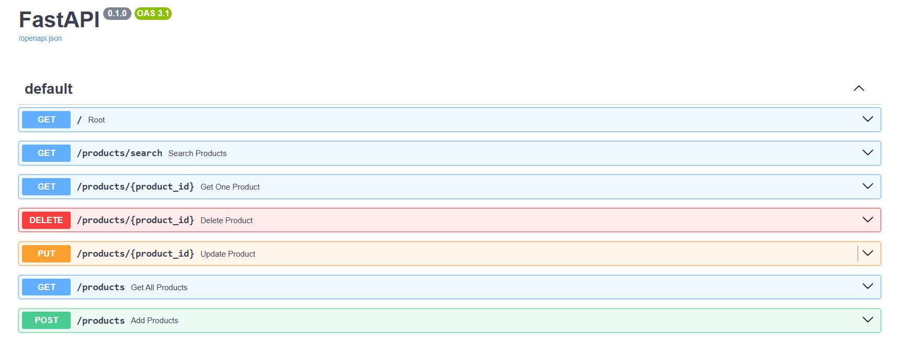
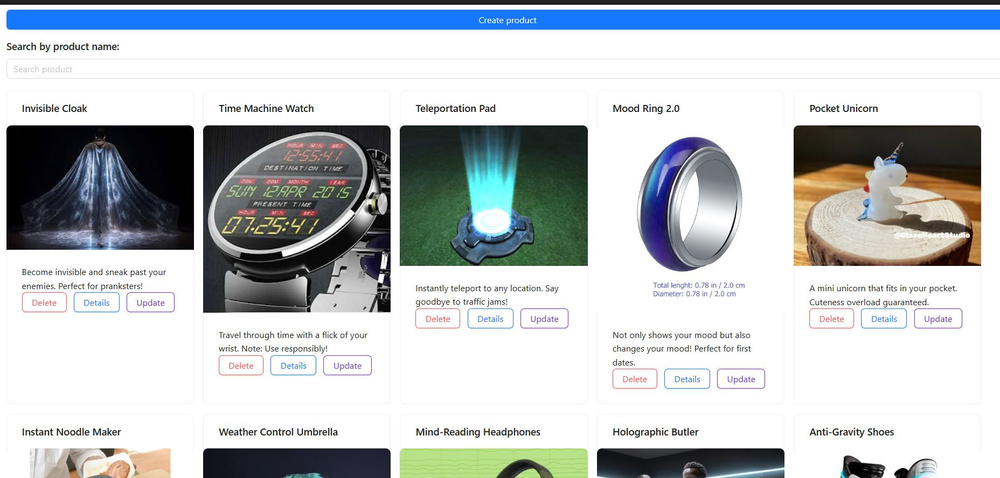
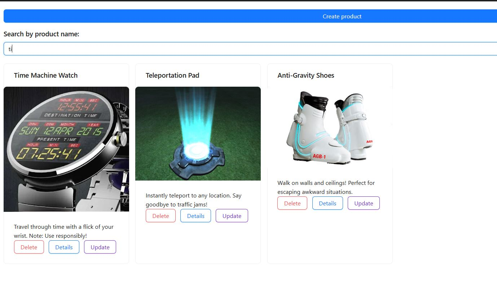
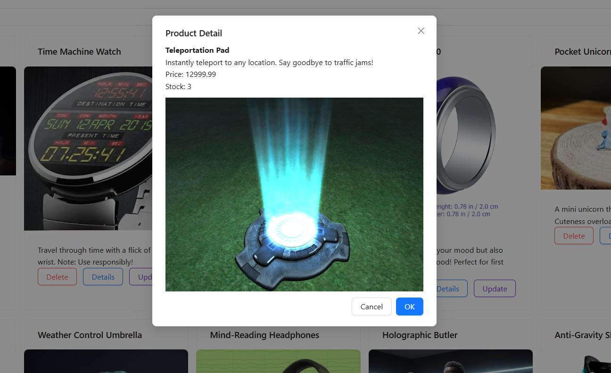
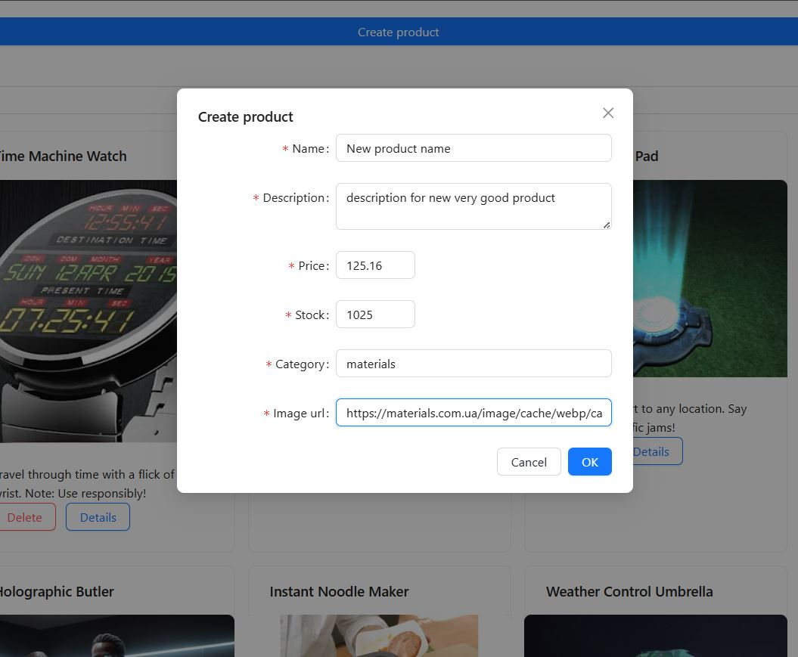
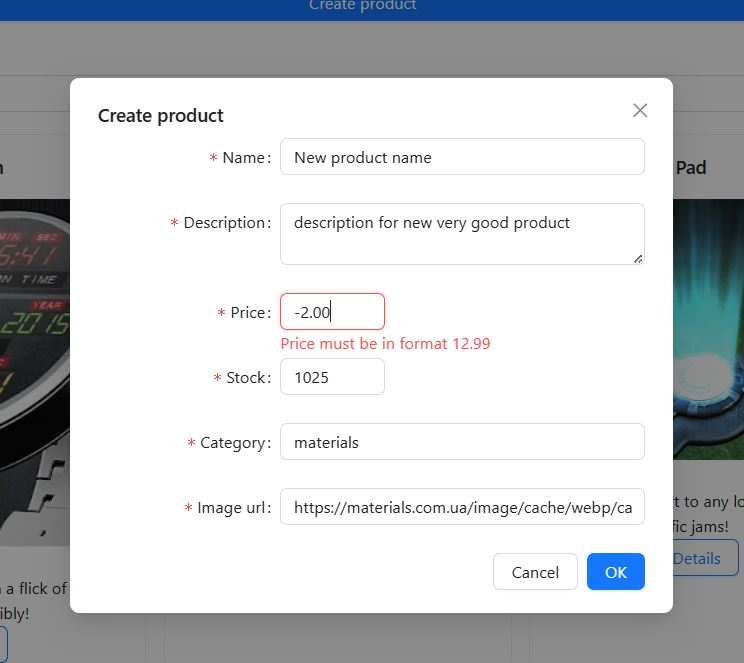
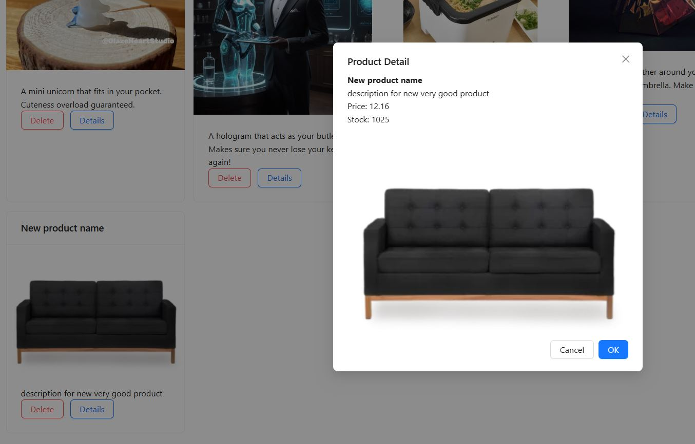
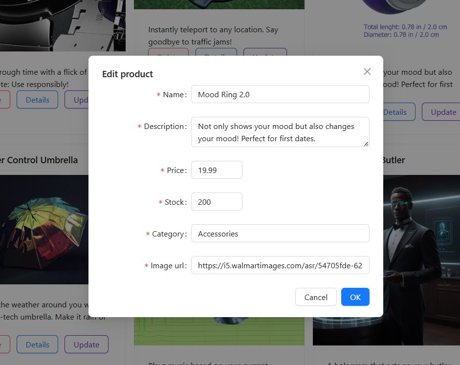

# Mini shop

A mini e-commerce feature where users can view a
list of products, search for products. The feature
include both backend and frontend components.

###  application deployed:
> Postgres DB - Neon https://neon.com/
> 
> Fastapi - Railway https://railway.com/
> 
> Frontend (react) - https://www.netlify.com/

## Project page:
https://fastapi-react-shop.netlify.app/


## Installing
A quick introduction how to run a development server

> Add .env file into backend directory with variable from backend/.env.example
> 
> Add .env file into frontend directory with variable from frontend/.env.example

Backend:
```shell
cd backend
uv install
alembic upgrade head
uvicorn app.main:app --reload
```
Development server should be opened on http://localhost:8000/products

Frontend:
```shell
cd frontend
npm run dev
```
Frontend server should be opened on http://localhost:5173/

## Description of project

### Backend libraries:
* Fastapi
* SQLAlchemy
* Alembic
* Pydantic

### Frontend libraries
* React
* Vite
* Axios
* TailWind
* ANT Design


### currently implemented endpoints:



On the main page of project we can see all list of products



We also can filter/serch for product name:



We can open detail info by clicking on the "detail" button



We can create new product by clicking on the "create product" button:



If you enter incorrect values - errors will be displayed



Product successfully created!



We can update product detail:


